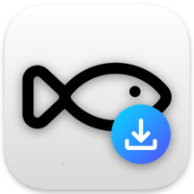

  
    
  
  # oldfish影片下載器  
  一個可以輕鬆下載 YouTube 影片的軟體  

  

## 特色 
- 支援下載最高 4K 畫質
- 同時下載多部影片
- 下載 shorts 短片
- 下載音軌
- 操作簡單
- 完全免費！

## 如何安裝
1. 下載[最新版本](https://github.com/oldfish101240/oldfish-Video-Downloader/releases/latest)  
2. 解壓縮 oldfish_downloader_Release.7z  
3. 打開 oldfishVDL.exe
4. 完成！

## 如何使用
1. 打開 oldfishVDL.exe  
2. 輸入欲下載的影片或播放清單網址
3. 按下"下載"按鈕  
4. 選擇正確畫質、檔案格式   
5. 按下"開始下載"按鈕  
6. 等待佇列進度條完成
7. 按下"資料夾"按鈕即可找到下載的檔案  

## 系統需求
- Windows 10/11 64bit
- 最少 1GB 以上的儲存空間

## 貢獻
### 回報 Bug
請在 [Issues頁面](https://github.com/oldfish101240/oldfish-Video-Downloader/issues) 上提交您發現的任何 Bug。

## 已知問題   
1. 下載的影片可能無法播放，可能是電腦不支援該編碼器，可以從 Microsoft Store 下載視訊延伸模組，或嘗試改用第三方影片播放器
2. 本軟體可能會被您的防毒軟體偵測為病毒 **(本軟體為開源項目，並未加入惡意程式碼)** 。如要解決此問題，請至您的防毒軟體將本軟體所在的目錄位置設為排除項目

## 常見問題FAQ
- Q：為什麼軟體被偵測為病毒？  
  A：本軟體為開源項目，並未加入惡意程式碼。會被偵測為病毒的原因是因為本軟體經過打包，請放心！
   
- Q：為什麼影片下載這麼久？  
  A：影片下載的速度依據您的網速而定，尤其是在下載高畫質且片長超過5分鐘的影片時，會下載較長時間，請耐心等候
  
- Q：能在Windows 7以下的舊環境運行此軟體嗎？  
  A：因為我沒有搭載 Windows 7 以下的作業系統的電腦，因此無法測試。不過您也可以試試！
  
- Q：能下載非YouTube網站上的影片嗎？  
  A：目前此軟體**僅支援於 YouTube 網站上下載影片**，但我們正在努力支援其他網站，等待好消息！

## 免責聲明
本軟體僅供**學習與個人研究用途**。  
使用者需**自行承擔使用本軟體所產生的一切風險與法律責任。**  
本專案不鼓勵或支持任何違反版權法、網站服務條款或其他相關法規的行為。  
請勿使用本軟體下載、散佈任何受版權保護之內容。  
開發者對於使用本軟體所造成的任何損失、法律責任或後果，概不負責。    

##  版權和許可
軟體、程式碼及文件版權由 [老魚oldfish](https://github.com/oldfish101240) 所有。軟體依據 [MIT License](LICENSE) 發布。  
Copyright (c) 2026 老魚oldfish
